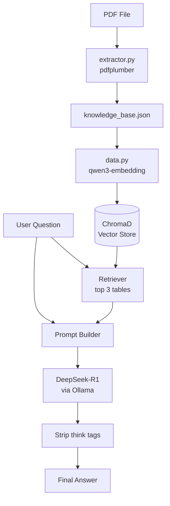

A local RAG pipeline that extracts tables from PDFs, 
embeds them using Ollama, and answers natural language 
questions using DeepSeek-R1 and ChromaDB.

The Complete Flow in One Diagram:

LLMs used via Ollama:
  deepseek-r1:14b Q4_K_M for answer generation
  qwen3-embedding:4b for embedding
Vector DB used: 
  ChromaDB

Why RAG Is Better Than Just Asking the LLM:
Without RAG:
Question → LLM → Answer (from training data, may hallucinate)
With RAG:
Question → Retrieve exact data → LLM reads data → Accurate answer

Can modify the LLMs used for answer generation in query1.py(5) and embedding in data.py(13)
